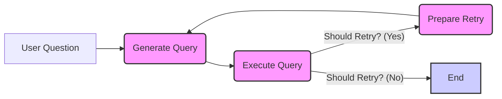
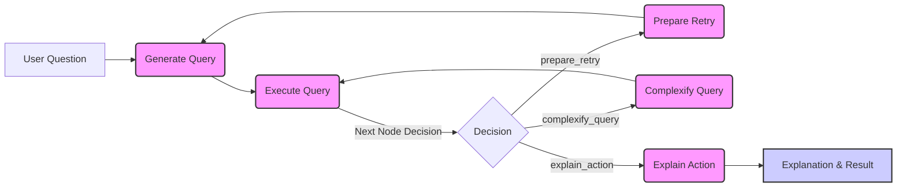

# NL2SQL Agent Documentation (Simplified Version)

This document provides an overview of a simplified NL2SQL agent application. This agent is designed to take natural language questions, convert them into SQL queries, execute them against a SQLite database, and return the results. This version focuses on query generation, execution, and basic retry logic without the complexity of query refinement or explanation.

## System Architecture

The NL2SQL agent is built using Flask, LangGraph, and OpenAI's language models.  The core workflow is defined by a LangGraph state graph, which manages the process of answering user questions.

Here's a Mermaid flowchart visualizing the workflow:

### Components

1.  **Flask Application:**
    *   Serves as the web API using the Flask framework.
    *   Handles file uploads (`.db` database files).
    *   Provides an endpoint to ask questions (`/api/ask`).

2.  **LangGraph State Graph:**
    *   Manages the state and flow of the NL2SQL process.
    *   Defines nodes for generating SQL queries, executing queries, and preparing for retries.
    *   Uses conditional edges to decide whether to retry query generation or end the process.

3.  **Language Model (LLM):**
    *   **`llm` (ChatOpenAI - finetuned model):** A finetuned OpenAI ChatCompletion model specialized in generating SQL queries from natural language. This model is responsible for understanding the user's question and translating it into a valid SQL query.

4.  **SQLDatabase (Langchain):**
    *   From Langchain, this utility is used to interact with the uploaded SQLite database.
    *   It is initialized from the uploaded database file and allows the agent to:
        *   Fetch table information (`get_table_info`).
        *   Execute SQL queries (`run`).
        *   Retrieve sample data (though not explicitly used in the retry mechanism, it's available for prompt context).

5.  **QueryState (TypedDict):**
    *   A `TypedDict` defining the structure of the state object that is passed between nodes in the LangGraph.
    *   Contains information about:
        *   `question`: The user's natural language question.
        *   `history`: The conversation history as a list of dictionaries, each containing `role` (user/assistant) and `content`.
        *   `sql_query`: The generated SQL query string.
        *   `result`: The result of executing the SQL query (as a dictionary) or an error message.
        *   `retries`: A counter for the number of retry attempts.

## Workflow Details

The LangGraph workflow consists of the following steps, as illustrated in the flowchart:

1. **`generate_query` Node:**
    * Constructs a prompt for the LLM, including system instructions, table info, sample data, history, and the user's question.
    * Invokes the LLM to generate a SQL query and updates the `QueryState` with the query and history.

2. **`execute_query` Node:**
    * Executes the generated SQL query against the database.
    * Processes the result into a dictionary format and updates the `QueryState` with the result or an error message.

3. **`should_retry` (Conditional Edge Decision):**
    * Checks for SQL execution errors or empty result sets.
    * Returns `True` if a retry is needed (error or empty result and retry limit not reached).

4. **`prepare_retry` Node:**
    * Increments the `retries` counter.
    * Adds an error message to the `history` to provide context to the LLM for the next query generation.

5. **End Node:**
    * Terminates the workflow when `should_retry` returns `False`.
    * The final `QueryState` contains the query, result, and history.

## Results

View results at [docs/README.md](docs/README.md)

## Conclusion

This documentation outlines the architecture, components, and usage of a simplified NL2SQL agent. This version provides a robust foundation for converting natural language questions into SQL queries and executing them, incorporating basic retry logic for error handling. While simpler than the more complex version, it demonstrates the core principles of building an agentic NL2SQL system using Flask, LangGraph, and finetuned language models.

---

# NL2SQL Agent Documentation (Agentic AI Version)

This document provides a comprehensive overview of the NL2SQL agent application, built using Flask, LangGraph, and OpenAI's language models. This agent is designed to convert natural language questions into SQL queries, execute them against a SQLite database, and provide results along with explanations of its reasoning.

## System Architecture

The NL2SQL agent is built using a LangGraph state graph, which defines the workflow for processing user questions. The architecture is visualized in the following Mermaid flowchart:

## Workflow Details

The LangGraph workflow consists of the following nodes and transitions:

1. **`generate_query` Node:**
    * Constructs a prompt for the LLM, including system instructions, table info, sample data, history, and the user's question, dynamically adjusting for complexity.
    * Instructs the LLM to generate a SQL query and updates the `QueryState` with the query and history.

2. **`execute_query` Node:**
    * Executes the generated SQL query against the database.
    * Formats the result into a dictionary and updates the `QueryState` with the result or an error message.

3. **`prepare_retry` Node:**
    * Increments the retry counter.
    * Adds an error message to the history to guide the next query generation.

4. **`complexify_query` Node:**
    * Prompts the LLM to generate a more complex SQL query based on the original question and the simple query result.
    * Updates the `QueryState` with the complex query and sets the `complexity_stage` to "complex".

5. **`explain_action` Node:**
    * Prompts the `explanation_llm` to generate a step-by-step explanation of the agent's actions.
    * Updates the `QueryState` with the explanation.

6. **`next_node_decision` (Conditional Edge):**
    * Determines the next node based on the `result` and `retries` count.
    * Transitions to `prepare_retry`, `complexify_query`, or `explain_action` based on the decision logic.

## Conclusion

This documentation provides a detailed understanding of the NL2SQL agent application, its architecture, workflow, components, setup, and API usage. It should help developers and users understand how to deploy, use, and potentially extend this agentic system. The Mermaid flowchart and step-by-step workflow descriptions visually and textually explain the agent's decision-making process and the flow of information within the LangGraph.
