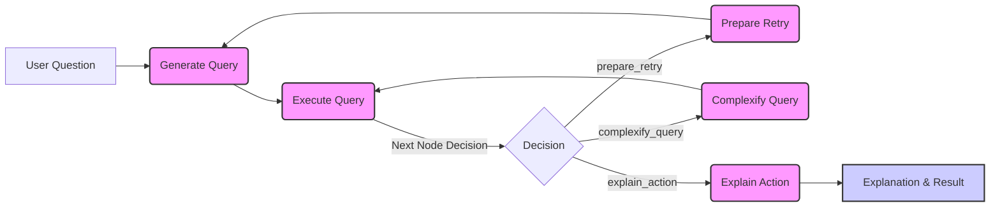

# Results

## 1. Context-Aware


To compare the results, I created a pivot table in the excel worksheet. <br>
 <br>
Here are the results from the excel worksheet corresponding to the output from generated SQL query:  


All the values from the original excel worksheet match with the output form generated SQL query

The context is carried throughout the question.

---
## 2. Handling Partial Entity Names in Queries
 <br>
To compare the results, I used the formula `=AVERAGEIFS(I:I, B:B, K2, E:E, "Rural", F:F, "Food and Beverages")` and `=AVERAGEIFS(I:I, B:B, B2, E:E, "Rural", F:F, "Fuel and Light")` in the original excel worksheet. 
`Column B = Year
Column E = Sector
Column F = Group
Column I = Inflation (%)` <br>


When a user asks question without using the full entity name, the AI understands it and uses the full entity name to query. In the example, user asks compare food and fuel inflation in rural sector. The generated SQL uses groups `Food and Beverages` and `Fuel and Light` when not explicitly mentioned.

---
## 3. Understanding Trends

To verify the results, I created a pivot table in the excel worksheet. <br>

All the values from the original excel worksheet match with the output form generated SQL query.

In the example, user asks show inflation rate trends in 2024. The generated SQL query returns results with average inflation rate for every month, sorted calender-wise, for better comparison. This highlights that the AI understands the intent behind "trends" and structures the SQL query accordingly.

---
## 4. Identifying Key Factors

To verify the results, I created a pivot table in the excel worksheet. <br>

All the values from the original excel worksheet match with the output form generated SQL query.

The user asks what factors are affecting the inflation rate. The generated SQL query returns results with average inflation for each subgroup showing which subgroup is affecting the inflation rate most. This highlights that the AI understands the intent and retrieves subgroup-level insights to explain inflation trends.

---
## 5. Year-over-Year Inflation


The user asks for year-over-year difference in inflation rate for every state. The generated SQL is complex which takes average for each year and then subtracts with the year preceeding it. The SQL results are also formatted in a user-friendly way to help compare easily.

---
## 6. Identifying Inflation Volatility (Statistical Analysis)

To verify the results, I created a pivot table in the excel worksheet. <br>

Values over the years 2021-2014 is considered, then the standard deviation of the inflation rate % is taken over those years.

The user asks for most volatile inflation. The generated SQL uses standard deviation to compare the inflation rates between subgroups. This uses mathematical queries to get meaningful results.

---
## 7. Analyzing Correlation (Statistical Analysis)


This example shows the SQL query using mathematical query for correlation between Index and Inflation rate, allowing easier understanding of the data.

---
## 8. Implementing SQL Query Retry Mechanism for Robust Execution


Error log:
```
INFO:root:prepare_retry: Input State: {'question': 'for food', 'history': ['show data', 'for food'], 'sql_query': "SELECT * FROM data WHERE Group = 'Food and Beverages' LIMIT 5;", 'result': {'error': '(sqlite3.OperationalError) near "Group": syntax error\n[SQL: SELECT * FROM data WHERE Group = \'Food and Beverages\' LIMIT 5;]\n(Background on this error at: https://sqlalche.me/e/20/e3q8)'}, 'retries': 0}
INFO:root:prepare_retry: Output State: {'question': 'for food', 'history': ['show data', 'for food', 'Previous SQL error: (sqlite3.OperationalError) near "Group": syntax error\n[SQL: SELECT * FROM data WHERE Group = \'Food and Beverages\' LIMIT 5;]\n(Background on this error at: https://sqlalche.me/e/20/e3q8)'], 'sql_query': "SELECT * FROM data WHERE Group = 'Food and Beverages' LIMIT 5;", 'result': {'error': '(sqlite3.OperationalError) near "Group": syntax error\n[SQL: SELECT * FROM data WHERE Group = \'Food and Beverages\' LIMIT 5;]\n(Background on this error at: https://sqlalche.me/e/20/e3q8)'}, 'retries': 1}
INFO:root:generate_query: Input State: {'question': 'for food', 'history': ['show data', 'for food', 'Previous SQL error: (sqlite3.OperationalError) near "Group": syntax error\n[SQL: SELECT * FROM data WHERE Group = \'Food and Beverages\' LIMIT 5;]\n(Background on this error at: https://sqlalche.me/e/20/e3q8)'], 'sql_query': "SELECT * FROM data WHERE Group = 'Food and Beverages' LIMIT 5;", 'result': {'error': '(sqlite3.OperationalError) near "Group": syntax error\n[SQL: SELECT * FROM data WHERE Group = \'Food and Beverages\' LIMIT 5;]\n(Background on this error at: https://sqlalche.me/e/20/e3q8)'}, 'retries': 1}
INFO:httpx:HTTP Request: POST https://api.openai.com/v1/chat/completions "HTTP/1.1 200 OK"
INFO:root:generate_query: Output State: {'sql_query': 'SELECT * FROM data WHERE "Group" = \'Food and Beverages\' LIMIT 5;', 'history': ['shiw data', 'for food', 'Previous SQL error: (sqlite3.OperationalError) near "Group": syntax error\n[SQL: SELECT * FROM data WHERE Group = \'Food and Beverages\' LIMIT 5;]\n(Background on this error at: https://sqlalche.me/e/20/e3q8)', 'for food'], 'question': 'for food', 'retries': 1}
INFO:root:execute_query: Input State: {'question': 'for food', 'history': ['show data', 'for food', 'Previous SQL error: (sqlite3.OperationalError) near "Group": syntax error\n[SQL: SELECT * FROM data WHERE Group = \'Food and Beverages\' LIMIT 5;]\n(Background on this error at: https://sqlalche.me/e/20/e3q8)', 'for food'], 'sql_query': 'SELECT * FROM data WHERE "Group" = \'Food and Beverages\' LIMIT 5;', 'result': {'error': '(sqlite3.OperationalError) near "Group": syntax error\n[SQL: SELECT * FROM data WHERE Group = \'Food and Beverages\' LIMIT 5;]\n(Background on this error at: https://sqlalche.me/e/20/e3q8)'}, 'retries': 1}
INFO:root:execute_query: Output State: {'result': {'columns': ['BaseYear', 'Year', 'Month', 'State', 'Sector', 'Group', 'SubGroup', 'Index', 'Inflation (%)'], 'data': [{'BaseYear': 2012, 'Year': 2024, 'Month': 'December', 'State': 'All India', 'Sector': 'Combined', 'Group': 'Food and Beverages', 'SubGroup': 'Cereals and Products', 'Index': 198.1, 'Inflation (%)': 6.51}, {'BaseYear': 2012, 'Year': 2024, 'Month': 'December', 'State': 'All India', 'Sector': 'Combined', 'Group': 'Food and Beverages', 'SubGroup': 'Meat and Fish', 'Index': 222.5, 'Inflation (%)': 5.3}, {'BaseYear': 2012, 'Year': 2024, 'Month': 'December', 'State': 'All India', 'Sector': 'Combined', 'Group': 'Food and Beverages', 'SubGroup': 'Egg', 'Index': 212.1, 'Inflation (%)': 6.85}, {'BaseYear': 2012, 'Year': 2024, 'Month': 'December', 'State': 'All India', 'Sector': 'Combined', 'Group': 'Food and Beverages', 'SubGroup': 'Milk and Products', 'Index': 187.5, 'Inflation (%)': 2.8}, {'BaseYear': 2012, 'Year': 2024, 'Month': 'December', 'State': 'All India', 'Sector': 'Combined', 'Group': 'Food and Beverages', 'SubGroup': 'Oils and Fats', 'Index': 183.7, 'Inflation (%)': 14.6}]}, 'history': ['show data', 'for food', 'Previous SQL error: (sqlite3.OperationalError) near "Group": syntax error\n[SQL: SELECT * FROM data WHERE Group = \'Food and Beverages\' LIMIT 5;]\n(Background on this error at: https://sqlalche.me/e/20/e3q8)', 'for food'], 'sql_query': 'SELECT * FROM data WHERE "Group" = \'Food and Beverages\' LIMIT 5;', 'question': 'for food', 'retries': 1}
```
This example shows the retry process included in the code. When an error is encountered during execution of a SQL Query, retry is triggered. The retry process includes passing the error along with the question again, it is repeated 3 times in case of en error. This will ensure less errors are occurred during execution, hence giving accurate results.

---

# NL2SQL Agent Documentation

This document provides a comprehensive overview of the NL2SQL agent application, built using Flask, LangGraph, and OpenAI's language models. This agent is designed to convert natural language questions into SQL queries, execute them against a SQLite database, and provide results along with explanations of its reasoning.

## System Architecture

The NL2SQL agent is built using a LangGraph state graph, which defines the workflow for processing user questions. The architecture is visualized in the following Mermaid flowchart:



### Components

1.  **Flask Application:**
    *   Handles API requests for file upload and question asking.
    *   Manages application configuration and routing.
    *   Returns JSON responses containing SQL queries, results, history, and explanations.

2.  **LangGraph State Graph:**
    *   Defines the workflow for processing user questions as a series of nodes and edges.
    *   Manages the state of the query process using `QueryState` TypedDict.
    *   Orchestrates the execution of different functions (nodes) based on the current state and decision logic.

3.  **Language Models (LLMs):**
    *   **`llm` (ChatOpenAI - finetuned model):**  Responsible for generating SQL queries based on user questions and database schema. Finetuned for SQL generation accuracy.
    *   **`explanation_llm` (ChatOpenAI - gpt-4o-mini):**  Used to generate step-by-step explanations of the agent's actions and reasoning process.

4.  **SQLDatabase (Langchain):**
    *   Connects to the uploaded SQLite database file.
    *   Provides functionalities to fetch table information (`get_table_info`), execute SQL queries (`run`), and retrieve sample data.

5.  **QueryState (TypedDict):**
    *   Defines the state object that is passed between nodes in the LangGraph.
    *   Contains information about the user question, conversation history, generated SQL query, execution result, retry count, complexity stage, explanation, and intermediate reasoning steps.

## Workflow Details

The LangGraph workflow consists of the following nodes and transitions:

1.  **`generate_query` Node:**
    *   **Function:** `generate_query(state: QueryState) -> QueryState`
    *   **Description:**
        *   Takes the current `QueryState` as input.
        *   Constructs a prompt for the `llm` including system instructions, table information, sample data, conversation history, and the user's question.
        *   Instructs the `llm` to generate a SQL query. The prompt is dynamically adjusted based on the `complexity_stage` ("simple" or "complex").
        *   Updates the `QueryState` with the generated `sql_query`, conversation history, and an intermediate reasoning step indicating SQL query generation.
    *   **Output:** Updated `QueryState` containing the generated SQL query.

2.  **`execute_query` Node:**
    *   **Function:** `execute_query(state: QueryState) -> QueryState`
    *   **Description:**
        *   Takes the `QueryState` containing the `sql_query` as input.
        *   Executes the `sql_query` against the SQLite database using `db.run()`.
        *   Formats the query result into a dictionary with `columns` and `data`.
        *   Handles potential SQL execution errors and stores error messages in the `result`.
        *   Updates the `QueryState` with the `result`, and an intermediate reasoning step indicating query execution and row count or error details.
    *   **Output:** Updated `QueryState` containing the query `result`.

3.  **`prepare_retry` Node:**
    *   **Function:** `prepare_retry(state: QueryState) -> QueryState`
    *   **Description:**
        *   Invoked when `execute_query` encounters an error or returns an empty result.
        *   Increments the retry counter in the `QueryState`.
        *   Adds an error message from the previous execution to the conversation history to guide the next query generation.
        *   Adds an intermediate reasoning step indicating a retry and the reason for it.
    *   **Output:** Updated `QueryState` with increased retry count and error context in history.

4.  **`complexify_query` Node:**
    *   **Function:** `complexify_query(state: QueryState) -> QueryState`
    *   **Description:**
        *   Invoked when `execute_query` is successful and the `complexity_stage` is "simple".
        *   Prompts the `llm` (same as `llm`) to generate a more complex SQL query based on the original question and the previously generated simple query and its result.
        *   The prompt instructs the LLM to refine the query by adding aggregations, filters, or further analysis while staying true to the original question.
        *   Updates the `QueryState` with the `complex_sql_query`, updated conversation history, sets `complexity_stage` to "complex", and adds an intermediate reasoning step for complex query generation.
    *   **Output:** Updated `QueryState` with the complex SQL query.

5.  **`explain_action` Node:**
    *   **Function:** `explain_action(state: QueryState) -> QueryState`
    *   **Description:**
        *   Invoked as the final step in the workflow after either successful complex query execution or after retry limits are reached.
        *   Prompts the `explanation_llm` to generate a step-by-step explanation of the agent's actions.
        *   The prompt includes the original question, final SQL query, execution result, retry count, and complexity stage.
        *   Updates the `QueryState` with the `explanation`, updated conversation history (including the explanation), and an intermediate reasoning step indicating explanation generation.
    *   **Output:** Updated `QueryState` containing the explanation.

6.  **`next_node_decision` (Conditional Edge):**
    *   **Function:** `next_node_decision(state: QueryState) -> str`
    *   **Description:**
        *   Determines the next node in the LangGraph workflow based on the `result` from `execute_query` and the `retries` count.
        *   **Decision Logic:**
            *   If the `result` contains an "error" or is empty, and `retries` is less than 5, transition to `prepare_retry`.
            *   If the `complexity_stage` is "simple" and the `result` is valid (no error and not empty), transition to `complexify_query`.
            *   Otherwise (if retries are exhausted or complex query stage is reached or valid result in complex stage), transition to `explain_action`.
    *   **Output:** A string indicating the name of the next node ("prepare_retry", "complexify_query", or "explain_action").

## Code Components

### Python Functions and Classes

*   **`QueryState(TypedDict)`:** Defines the structure of the state object used in LangGraph to manage information flow between nodes.

    ```python
    class QueryState(TypedDict):
        question: str
        history: List[Dict[str, str]]
        sql_query: str
        result: Optional[dict]
        retries: int
        complexity_stage: str
        explanation: Optional[str]
        intermediate_reasoning: List[str]
    ```

*   **`allowed_file(filename)`:** Helper function to check if the uploaded file has an allowed extension (`.db`).

*   **`upload_file()` (@app.route('/api/upload', methods=['POST']))**: Flask API endpoint for handling file uploads.
    *   Receives a database file (`.db`) via POST request.
    *   Saves the file to the `uploads` folder.
    *   Initializes `db` (SQLDatabase) and fetches `sample_data` from the uploaded database.
    *   Returns a JSON response indicating success or error.

*   **`ask_question()` (@app.route('/api/ask', methods=['POST']))**: Flask API endpoint to process user questions.
    *   Receives a JSON request with `question` and optional `history`.
    *   Initializes the `QueryState` with the provided question and history.
    *   Creates the LangGraph workflow using `create_graph()`.
    *   Invokes the LangGraph with the initial `QueryState` using `graph.invoke(state)`.
    *   Returns a JSON response containing `sql_query`, `result`, `history`, `explanation`, and `reasoning` from the final state.

*   **`create_graph()`**: Function responsible for defining and compiling the LangGraph workflow.
    *   Defines each node in the graph (`generate_query`, `execute_query`, `prepare_retry`, `complexify_query`, `explain_action`) using the corresponding Python functions.
    *   Defines edges between nodes, including a conditional edge based on `next_node_decision`.
    *   Sets the entry point of the graph to `generate_query`.
    *   Compiles the LangGraph using `graph.compile()` and returns the compiled graph.

*   **`generate_query(state: QueryState) -> QueryState`**:  LangGraph node function - Generates SQL query (described in Workflow Details).

*   **`execute_query(state: QueryState) -> QueryState`**: LangGraph node function - Executes SQL query (described in Workflow Details).

*   **`prepare_retry(state: QueryState) -> QueryState`**: LangGraph node function - Prepares for query retry (described in Workflow Details).

*   **`complexify_query(state: QueryState) -> QueryState`**: LangGraph node function - Generates a more complex SQL query (described in Workflow Details).

*   **`explain_action(state: QueryState) -> QueryState`**: LangGraph node function - Generates explanation of agent's actions (described in Workflow Details).

*   **`next_node_decision(state: QueryState) -> str`**: LangGraph node function - Decides the next node in the workflow (described in Workflow Details).

## Conclusion

This documentation provides a detailed understanding of the NL2SQL agent application, its architecture, workflow, components, setup, and API usage. It should help developers and users understand how to deploy, use, and potentially extend this agentic system. The Mermaid flowchart and step-by-step workflow descriptions visually and textually explain the agent's decision-making process and the flow of information within the LangGraph.
